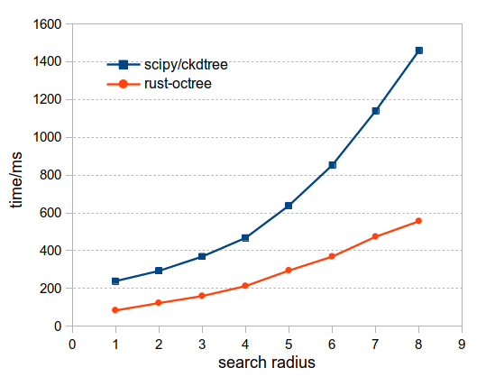

This is my first crate for learning Rust.

# Performance

test data: examples/data/3wu2.xyz, coordinates of 51053 particles extracted from
a PDB file 3wu2 <a id="fnr.1" class="footref" href="#fn.1">1</a>

## How to to reproduce

rust-octree (v0.0.6):

    RAYON_NUM_THREADS=1 cargo run --example demo --release

scipy-ckdtree(v1.3.2):

    ipython> edit scripts/bench.py
    ipython> %timeit -n 10 run_test()

# Related crates

-   [dorsath/octree: An octree implementation in rust](https://github.com/dorsath/octree)
-   [Nercury/octree-rs: Bounded octree structure](https://github.com/Nercury/octree-rs)

# References

-   Behley, J.; Steinhage, V.; Cremers, A. B. Efficient Radius Neighbor Search in
    Three-Dimensional Point Clouds. In 2015 IEEE International Conference on
    Robotics and Automation (ICRA); 2015; pp 3625–3630.
-   [scipy.spatial.cKDTree — SciPy Reference Guide](https://docs.scipy.org/doc/scipy/reference/generated/scipy.spatial.cKDTree.html)
-   [storpipfugl/pykdtree: Fast kd-tree implementation in Python](https://github.com/storpipfugl/pykdtree)

# Footnotes

<a id="fn.1" href="#fnr.1">1</a> <https://www.rcsb.org/structure/3wu2>
